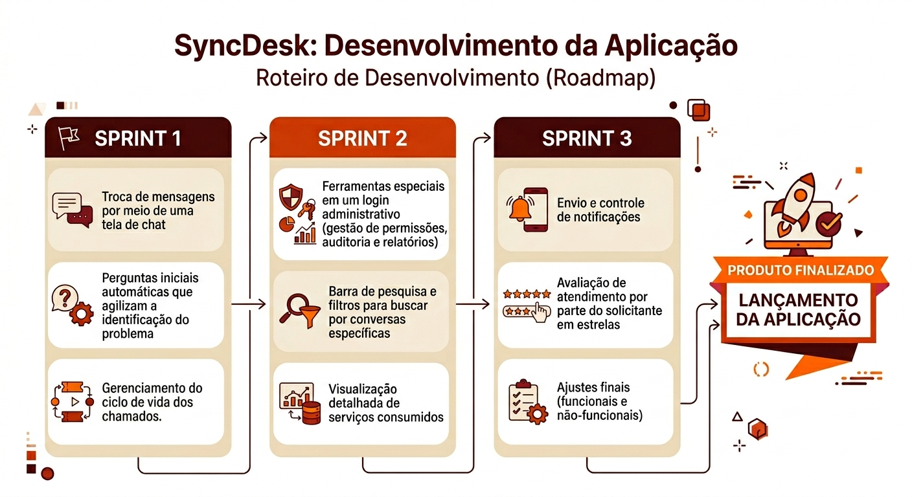
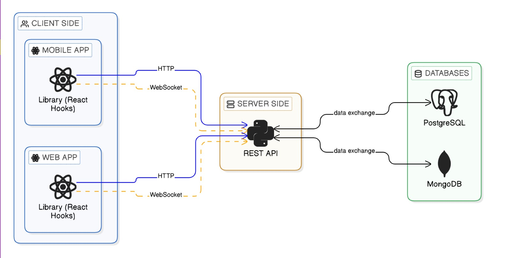

# SyncDesk

**Sistema Estruturado para Atendimento, Triagem e Escalonamento de Demandas**

> **Status do Projeto: Em Desenvolvimento**

## Desafio

Desenvolver uma aplicação mobile que centralize o atendimento ao cliente por meio de um sistema de chat estruturado que registre o
histórico completo das interações e permita o acompanhamento do fluxo de atendimento, incluindo abertura, escalonamento e encerramento de chamados. A jornada deve iniciar com uma triagem automatizada. O objetivo geral é estruturar e otimizar o processo de atendimento, promovendo eficiência
operacional, melhor experiência ao cliente e maior controle gerencial. 

## ⚡ Desenvolvimento Ágil

O projeto está sendo seguindo o método Ágil SCRUM, dividindo o trabalho em sprints de 21 dias, com reuniões diáras, revisões e retrospectivas ao final.

### 📋 Backlog do Produto

| Sprint | User Story | Status | Prioridade |
| :---  | :--- | :--- | :--- |
| **1** | Como atendente, quero poder trocar mensagens com clientes em uma tela de chat, para conseguir compreender suas necessidades e auxiliar rapidamente.  | CONCLUÍDA | ▲ Alta |
| **1** | Como solicitante, quero começar uma conversa rapidamente e ser guiado com algumas perguntas iniciais, para que meu problema seja identificado de forma ágil e descomplicada. | CONCLUÍDA | ▲ Alta |
| **1** | Como atendente, quero gerenciar o ciclo de vida dos chamados (atualizar status, encaminhar, atribuir e encerrar), para acompanhar e controlar as solicitações dos clientes. | CONCLUÍDA | ▲ Alta |
| **2** | Como gestor da aplicação, quero que o meu acesso possua ferramentas administrativas (como gestão de permissões, auditoria e relatórios), para ter controle sobre a operação do suporte. | PENDENTE | **=** Média |
| **2** | Como usuário do sistema, quero buscar conversas no histórico de atendimentos com base em critérios como nome do destinatário e data, para localizar atendimentos específicos de forma mais rápida. | PENDENTE | ▼ Baixa |
| **3** | Como solicitante do atendimento, quero receber notificações quando houver atualizações nos meus chamados, para acompanhar o andamento dos atendimentos sem precisar acessar constantemente o sistema. | PENDENTE | **=** Média |
| **3** | Como solicitante do atendimento, quero poder deixar uma avaliação após o encerramento, para registrar meu nível de satisfação com o suporte prestado. | PENDENTE | ▼ Baixa |

### 📅 Cronograma

| Sprint            | Prazo      | Status       | Entrega |
| ----------------- | ---------- | ------------ | ------- |
| Kick Off          | 03/03/2026 | Concluído    | -       |
| Sprint 1          | 05/04/2026 | Concluído    | [video](https://youtu.be/ucNTISGGgis)       |
| Sprint 2          | 03/05/2026 | Não iniciado | -     |
| Sprint 3          | 31/05/2026 | Não iniciado | -       |
| Feira de Soluções | 11/06/2026 | Não iniciado | -       |

### Roadmap

### 👥 Fatec São José dos Campos - Prof. Jessen Vidal

| Cliente          | Período/Curso                                  | Professor P2     | Contato Cliente                    |
| ---------------- | ---------------------------------------------- | ---------------- | ---------------------------------- |
| Larissa Souza e Rafael Monteiro - Empresa Pro4Tech | 5º Análise e Desenvolvimento de Sistemas | Gerson Penha | <https://www.linkedin.com/company/pro4tech/> |

## Arquitetura

-----

Abaixo você encontra os links para acessar o repositório de cada serviço.

-----

### ⚙️ [SyncDesk API](https://github.com/Titus-System/syncdesk-api)

O `syncdesk-api`, construído com FastAPI, é o **núcleo central** da aplicação, responsável por gerenciar toda a lógica de negócio, a comunicação entre os sistemas e a persistência dos dados. 

**Principais Responsabilidades:**

- **Comunicação e Atendimento:** Gerencia o fluxo de dados das conversas (envio, recebimento e recuperação do histórico de mensagens entre solicitantes e atendentes).
- **Autenticação e Controle de Acesso:** Realiza o gerenciamento de usuários, incluindo login, cadastro e controle de permissões por perfil (solicitante, atendente e administrador).
- **Gestão de Chamados:** Controla o ciclo de vida dos atendimentos (criação, atualização de status e regras de negócio associadas ao atendimento).
- **Processamento da Triagem Automatizada:** Executa a lógica do atendimento inicial automatizado, avaliando respostas do usuário e definindo os próximos passos do fluxo.
- **Monitoramento e Métricas:** Disponibiliza métricas e indicadores de desempenho da aplicação, permitindo acompanhamento da saúde do sistema.
- **Persistência de Dados:** Gerencia o armazenamento de dados em diferentes bancos:
  - PostgreSQL para dados estruturados (usuários, chamados, permissões)
  -  MongoDB para dados mais dinâmicos (mensagens e interações)

**Tecnologias-chave:** `Python`, `FastAPI`, `SQLAlchemy`, `PostgreSQL`, `MongoDB`, `JWT`, `Docker`, `Pytest`.

-----

### 📱 [SyncDesk Mobile](https://github.com/Titus-System/syncdesk-mobile)

O `syncdesk-mobile` é a **aplicação cliente** desenvolvida em React Native, responsável por fornecer a interface para os solicitantes interagirem com o sistema de atendimento. Ele permite a abertura de atendimentos, comunicação em tempo real com o suporte e acompanhamento do histórico de conversas. A aplicação é construída sobre a arquitetura do Expo.

**Principais Responsabilidades:**

- **Interface do Usuário:** Implementa as telas da aplicação mobile, com a garantia uma experiência fluida e responsiva para o solicitante.
- **Comunicação em Tempo Real:** Integra o cliente WebSocket para envio e recebimento de mensagens em tempo real, permitindo interação contínua com atendentes e com o sistema automatizado.
- **Consumo de APIs e Histórico de Dados:** Realiza chamadas REST para recuperação de dados como históricos de conversas, incluindo suporte à paginação.
- **Integração com Triagem Automatizada:** Exibe e processa as mensagens automáticas iniciais, com suporte a respostas estruturadas (como botões de seleção), conforme definido pelos contratos de API.

**Tecnologias-chave:** `React Native (Expo)`, `TypeScript`, `TailWindCSS`, `WebSocket`, `Node`, `ESLint`.

-----

### 🖥️ [SyncDesk Web](https://github.com/Titus-System/syncdesk-web)

O `syncdesk-web` gerencia o frontend voltado para atendentes e administradores. Desenvolvido com React e Vite, ele oferece uma interface para gerenciamento de chamados, controle de usuários, dashboards de monitoramento e gestão operacional do sistema. As telas priorizam organização das informações para uso proveitoso em ambiente corporativo.

**Principais Responsabilidades:**

- **Interface moderna e responsiva:** Construída com React e TailwindCSS, com foco em clareza visual, organização e produtividade no uso diário.
- **Controle de Acesso e Perfis:** Suporta diferentes níveis de acesso, com funcionalidades específicas para atendentes e administradores.
- **Consumo de APIs e Sincronização de Dados:** Utiliza React Query para gerenciamento de estado assíncrono e consumo eficiente das APIs REST.
- **Comunicação em Tempo Real:** Integra WebSocket para envio e recebimento de mensagens, mantendo a interface sincronizada com o backend.
- **Manutenção de Chamados:** Permite visualizar e controlar o status dos chamados ao longo do fluxo de atendimento.

**Tecnologias-chave:** `React`, `JavaScript`, `Vite`, `React Query`, `WebSocket`, `TailwindCSS`, `Node`, `ESLint`.

-----

### 🗂️ [SyncDesk Library](https://github.com/Titus-System/syncdesk-library)

O `syncdesk-library` é uma **biblioteca compartilhada** responsável por **padronizar a comunicação entre os frontends (mobile e web) e o backend da aplicação**. Publicada como pacote npm, ela centraliza a lógica de integração, garantindo consistência no consumo das APIs.

**Principais Responsabilidades:**

- **Padronização da Integração com o Backend:** Define uma camada única de comunicação para os frontends, para que mobile e web utilizem os mesmos contratos e estruturas de requisição.
- **Gerenciamento de Requisições HTTP:** Utiliza Axios para estruturar chamadas REST, centralizando configurações como base URL, headers e interceptadores.
- **Configuração Dinâmica:** Permite configuração dinâmica por meio de funções como `configureLibrary`, adaptando a biblioteca a diferentes ambientes.
- **Reutilização e Desacoplamento:** Evita duplicação de lógica e código, promovendo manutenção simplificada e evolução independente das interfaces.

**Tecnologias-chave:** `TypeScript`, `Axios`, `WebSocket`, `React`, `npm`.

## 🛠️ Tecnologias Utilizadas

  
  
  
  
  
  
  
  

  
  
  
  
  
  
  

  
  
  
  
  

## 🎓 Equipe 

  <table>
    <tr>
      <th>Membro</th>
      <th>Função</th>
      <th>Github</th>
      <th>Linkedin</th>
    </tr>
    <tr>
      <td>Julia Pereira</td>
      <td>Product Owner</td>
      <td>
        
      </td>
      <td>
        
      </td>
    </tr>
    <tr>
      <td>Wesley Gonçalves</td>
      <td>Scrum Master</td>
      <td>
        
      </td>
      <td>
        
      </td>
    </tr>
    <tr>
      <td>Pedro Garcia</td>
      <td>Dev Team</td>
      <td>
        
      </td>
      <td>
        
      </td>
    </tr>
    <tr>
      <td>Eduardo Ribeiro</td>
      <td>Dev Team</td>
      <td>
        
      </td>
      <td>
        
      </td>
    </tr>
    <tr>
      <td>Maria Fernanda Diniz</td>
      <td>Dev Team</td>
      <td>
        
      </td>
      <td>
        
      </td>
    </tr>
    <tr>
      <td>Angelina Borroni</td>
      <td>Dev Team</td>
      <td>
        
      </td>
      <td>
        
      </td>
    </tr>
    <tr>
      <td>Pablo Rafael</td>
      <td>Dev Team</td>
      <td>
        
      </td>
      <td>
        
      </td>
    </tr>
    <tr>
      <td>Matheus Germano</td>
      <td>Dev Team</td>
      <td>
        
      </td>
      <td>
        
      </td>
    </tr>
  </table>

