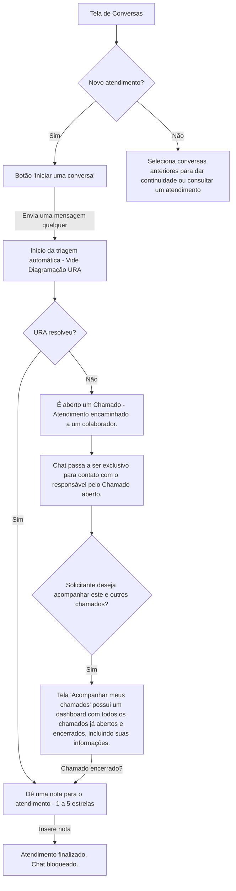

```mermaid
flowchart TD
    A[Tela de Conversas] --> B{Novo atendimento?}
    B -->|Sim| C[Botão 'Iniciar uma conversa']
    B -->|Não| D[Seleciona conversas anteriores para dar continuidade ou consultar um atendimento]
    C -->|Envia uma mensagem qualquer| E[Início da triagem automática - Vide Diagramação URA]
    E --> F{URA resolveu?}
    F -->|Sim| G[Dê uma nota para o atendimento - 1 a 5 estrelas]
    G -->|Insere nota| L[Atendimento finalizado. Chat bloqueado.]
    F -->|Não| H[É aberto um Chamado - Atendimento encaminhado a um colaborador.]
    H --> I[Chat passa a ser exclusivo para contato com o responsável pelo Chamado aberto.]
    I --> J{Solicitante deseja acompanhar este e outros chamados?}
    J -->|Sim| K[Tela 'Acompanhar meus chamados' possui um dashboard com todos os chamados já abertos e encerrados, incluindo suas informações.]
    K -->|Chamado encerrado?| G
```
