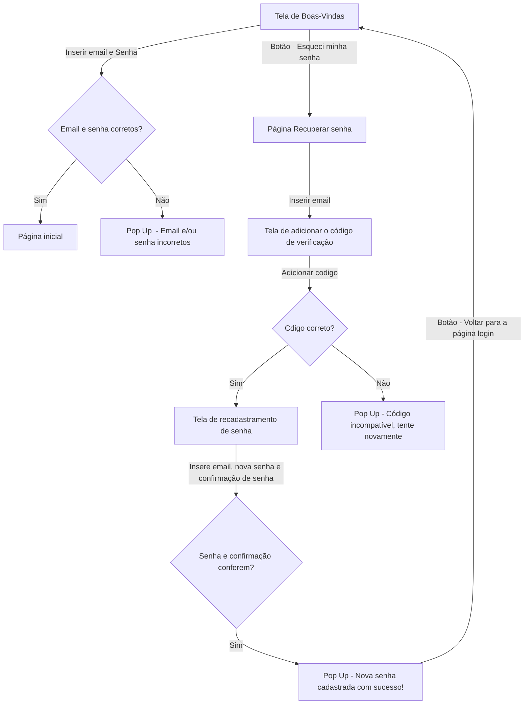

```mermaid
flowchart TD
    A[Tela de Boas-Vindas] -->|Inserir email e Senha| B{Email e senha corretos?}
    B -->|Sim| C[Página inicial]
    B -->|Não| D[Pop Up  - Email e/ou senha incorretos]
    A -->|Botão - Esqueci minha senha| E[Página Recuperar senha]
    E -->|Inserir email| F[Tela de adicionar o código de verificação]
    F -->|Adicionar codigo|G{Cdigo correto?}
    G -->|Sim| H[Tela de recadastramento de senha]
    G -->|Não| I[Pop Up - Código incompatível, tente novamente]
    H -->|Insere email, nova senha e confirmação de senha| J{Senha e confirmação conferem?}
    J -->|Sim| K[Pop Up - Nova senha cadastrada com sucesso!]
    K -->|Botão - Voltar para a página login| A
```
